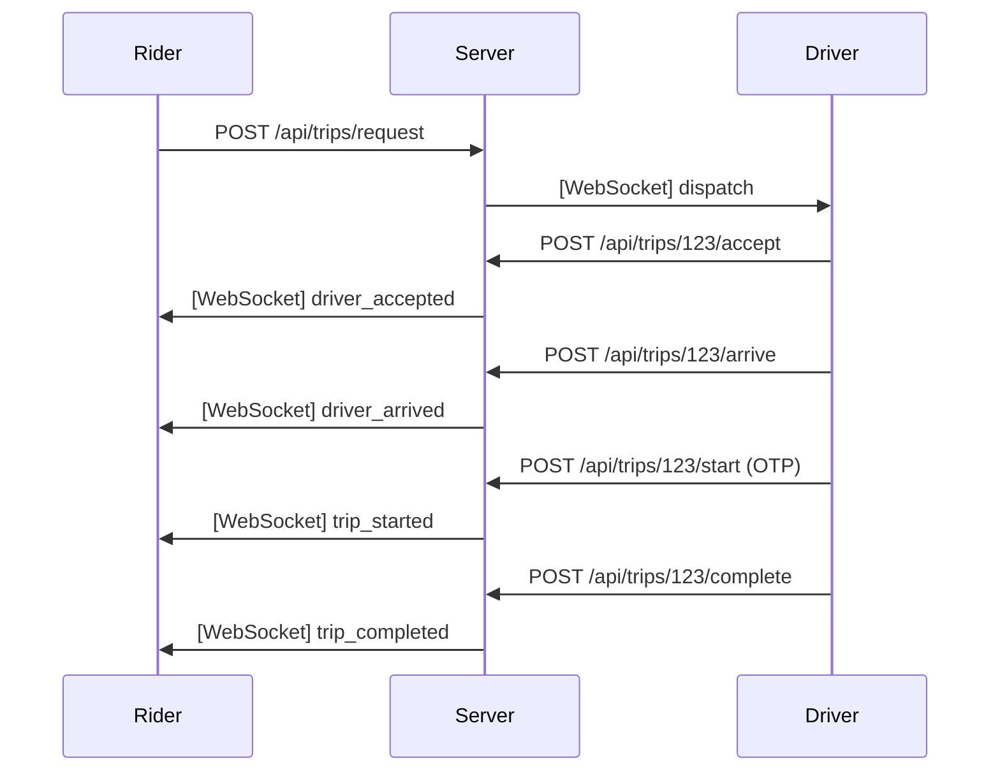

# Driver Trip API Documentation

# Overview
The Driver Trip API provides explicit REST endpoints for drivers to interact with trips, completely replacing the previous GPS-driven automatic state transitions. Drivers can now autonomously Accept, Reject, Arrive, Start (with OTP), and Complete trips.

# Motivation
The legacy system advanced trips from `ASSIGNED` -> `ARRIVED` -> `IN_PROGRESS` -> `COMPLETED` based entirely on proximity via the `getDistanceKm` function inside the WebSocket handler. This was a critical flaw that removed driver autonomy, failed to handle edge cases (e.g., driver arrives but rider is nowhere to be found), and lacked proper validation and atomic concurrency control.

# Architecture
- **WebSockets** are now relegated to a "dumb pipe" strictly for broadcasting location telemetry and pushing notifications (e.g., dispatch alerts) to the client.
- **REST APIs** handle all state-mutating actions, guarded by JWT authentication and strict role validation.
- **Optimistic Concurrency** is used during the `acceptTrip` phase to prevent multiple drivers from claiming the same ride.

# Components
- **trip_routes.ts**: Exposes 5 new POST endpoints mounted under `/api/trips/:id/*`.
- **trip_service.ts**: Contains the core business logic ensuring a trip can only transition along a valid state machine path.
- **ws_handler.ts**: Stripped of transition logic; now only updates Redis driver locations.

# Request Flow
1. **Rider requests a ride**: Trip is created via `/api/trips/request`. Status is `REQUESTED`.
2. **Matching Engine**: Finds the closest driver and uses Redis Pub/Sub to send a dispatch notification.
3. **Driver accepts**: Driver client calls `POST /api/trips/:id/accept`. The DB atomically updates the trip to `ASSIGNED`.
4. **Driver arrives**: Driver client calls `POST /api/trips/:id/arrive`. Trip becomes `ARRIVED`.
5. **Rider boards**: Driver asks for OTP, client calls `POST /api/trips/:id/start` with `{ otp: "1234" }`. Trip becomes `IN_PROGRESS`.
6. **Destination reached**: Driver calls `POST /api/trips/:id/complete`. Trip becomes `COMPLETED` and the driver is marked `ONLINE` again.

# Database Schema
Affects the `Trip` table.
- Mutated fields: `status`, `driverId`, `startedAt`, `completedAt`.

# Redis Usage
- Updates `driver:data:{driverId}` hash:
  - Changes status to `IN_TRIP` upon acceptance.
  - Reverts status to `ONLINE` upon completion.

# API Contracts
All endpoints require a `Bearer <token>` where `role === 'DRIVER'`.

### `POST /api/trips/:id/accept`
- **Response 200**: `{ status: 'success', trip: TripState }`
- **Response 400**: If trip is no longer `REQUESTED`.

### `POST /api/trips/:id/reject`
- **Response 200**: `{ status: 'success', message: 'Trip rejected and re-dispatch triggered' }`
- **Action**: Triggers the `trip.rejected` event to re-query the matching engine.

### `POST /api/trips/:id/arrive`
- **Response 200**: `{ status: 'success', trip: TripState }`
- **Response 400**: If driver is not the assigned driver or trip is not `ASSIGNED`.

### `POST /api/trips/:id/start`
- **Body**: `{ "otp": "4820" }`
- **Response 200**: `{ status: 'success', trip: TripState }`
- **Response 400**: If OTP is invalid.

### `POST /api/trips/:id/complete`
- **Response 200**: `{ status: 'success', trip: TripState }`

# Sequence Diagram

# Configuration
No new environment variables required.

# Failure Handling
- **Concurrency**: If Driver A and Driver B both receive a dispatch (e.g., due to a retry), the `updateMany` clause in Prisma ensures only the first driver who calls `/accept` will transition the state. The second driver receives a 400 Bad Request.

# Monitoring
- Monitor HTTP 400s on the `/accept` endpoint to measure how often drivers are "beaten" to a dispatch (high concurrency conflict rate).

# Scaling
By moving state transitions from WebSockets to REST APIs, we free up the WebSocket servers to purely handle network I/O, allowing them to scale horizontally using Redis Pub/Sub without managing complex business logic state.

# Security
- Roles are strictly validated (`requireDriver`).
- A driver can only mutate a trip if `trip.driverId === driver.userId`.

# Testing
- Ensure the OTP endpoint strictly requires a 4-digit string.
- Mock the driver JWT and attempt to `arrive` before `accept`. Ensure a 400 error is thrown due to invalid state transition.

# Deployment
Requires a standard Node.js server restart. No new database migrations are required for this specific feature since the `Trip` schema already possessed the necessary fields (`status`, `startedAt`, etc.).

# Troubleshooting
- **Driver cannot accept trip**: Check if the trip was cancelled by the rider or claimed by another driver. The HTTP response will explicitly state the current status.
- **Rider not receiving updates**: Ensure the WebSocket PubSub service is actively running and connected to Redis, as the REST API uses `eventBus` which routes to PubSub.

# FAQ
**Q: Why not use WebSockets for accepting trips?**
A: WebSockets in this architecture currently bypass JWT validation. Using REST APIs allows us to leverage the existing robust HTTP middleware for authentication, rate limiting, and structured JSON responses.

# Learning Notes
- **Concept Learned**: **Optimistic Concurrency Control**. Using an update predicate (`where: { id: tripId, status: 'REQUESTED' }`) is a lock-free way to prevent race conditions in distributed systems. 
- **Production Mistake**: Relying on GPS coordinates to auto-complete trips often fails in the real world due to urban canyons, bad GPS chips, or riders walking a block away from the pin. Explicit human action is always required for financial transactions.
- **Architecture Best Practice**: Separate the transport layer (WebSockets for real-time telemetry) from the business logic layer (REST for authenticated state mutations).
