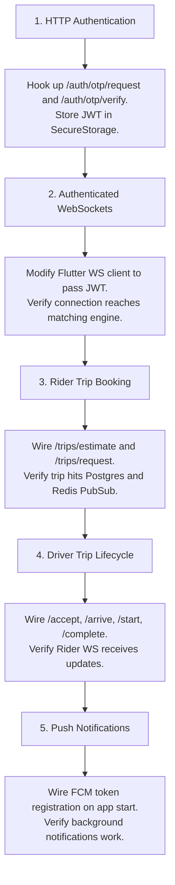

# Ride Matching Product Integration Matrix

This document outlines the strict end-to-end integration requirements to complete a single successful ride on the Ride Matching platform. It ignores purely architectural improvements in favor of connecting the existing mobile frontends to the existing backend endpoints.

---

## 1. RIDER APP FLOW AUDIT

### 1.1 Login & Authentication
- **Flutter Screen**: `onboarding_screens.dart`
- **Backend Endpoint**: `POST /api/auth/otp/request` & `POST /api/auth/otp/verify`
- **Request DTOs**: `{ phone: string }` & `{ phone: string, code: string }`
- **Response DTOs**: `{ message: string }` & `{ token: string, user: object }`
- **WebSocket Events**: None
- **Authentication**: None (Public)
- **Loading States**: Disable "Send OTP" and "Verify" buttons. Show circular progress.
- **Error States**: Invalid phone format, Incorrect OTP, Network timeout.
- **Retry Logic**: Allow resending OTP after 30s.
- **Offline Handling**: Disable buttons, show "No Internet" snackbar.
- **Navigation**: On success -> `home_screen.dart`
- **Local State Updates**: Store JWT in SecureStorage. Store User profile in `UserProfileNotifier`.
- **Backend State Updates**: User created/updated.

### 1.2 Search & Destination
- **Flutter Screen**: `destination_picker_screen.dart` & `home_screen.dart`
- **Backend Endpoint**: None (Direct to Ola Maps API, *Recommendation: Proxy via backend later, direct is fine for pilot day 1*)
- **WebSocket Events**: None
- **Authentication**: Ola API Key
- **Local State Updates**: Update `pickupLat/Lng` and `dropoffLat/Lng` in `LocationStateNotifier`.

### 1.3 Estimate Fare & Book Ride
- **Flutter Screen**: `ride_summary_screen.dart`
- **Backend Endpoint**: `POST /api/trips/estimate` & `POST /api/trips/request`
- **Request DTOs**: `{ pickupLat, pickupLng, dropoffLat, dropoffLng, cityId }` & `{ pickupLat, pickupLng, dropoffLat, dropoffLng, vehicleType, estimatedFare }`
- **Response DTOs**: `{ estimates: Array<{ vehicleType, fare, eta }> }` & `{ tripId, status }`
- **WebSocket Events**: Emits `trip_requested` internally on backend.
- **Authentication**: Bearer Token (JWT)
- **Loading States**: Shimmer effect on pricing cards. Disable "Confirm Ride".
- **Error States**: "Pricing unavailable", "No drivers nearby", "Payment method required".
- **Retry Logic**: Retry estimate fetch 3 times on timeout.
- **Navigation**: On success -> `searching_driver_screen.dart`
- **Local State Updates**: Save `tripId` in `BookingNotifier`.
- **Backend State Updates**: Trip created with `REQUESTED` status.

### 1.4 Driver Assigned & Live Tracking
- **Flutter Screen**: `tracking_screen.dart`
- **Backend Endpoint**: None (Uses WebSockets)
- **WebSocket Events**: Listens for `trip_assigned`, `driver_location_update`, `trip_arrived`, `trip_started`.
- **Authentication**: WS connection must pass `token=JWT` in query params.
- **Loading States**: Map rendering.
- **Error States**: WS disconnect (Show "Reconnecting...").
- **Offline Handling**: Attempt WS reconnect exponentially.
- **Local State Updates**: Update driver marker on Map, update ETA, transition UI states (Waiting -> Arrived -> In Progress).
- **Navigation**: On `trip_completed` -> `trip_summary_screen.dart`

### 1.5 Trip Completed & Payment
- **Flutter Screen**: `trip_summary_screen.dart`
- **Backend Endpoint**: None for COD (Handled by driver).
- **WebSocket Events**: `trip_completed`
- **Navigation**: "Done" -> `home_screen.dart`
- **Local State Updates**: Clear `BookingNotifier`.

---

## 2. DRIVER APP FLOW AUDIT

### 2.1 Login & Auth
- **Flutter Screen**: `onboarding_screens.dart`
- *(Identical to Rider App flow)*

### 2.2 Go Online / Offline
- **Flutter Screen**: `home_screen.dart`
- **Backend Endpoint**: None (Uses WebSockets)
- **WebSocket Events**: Send `driver_online` and `driver_location_update`.
- **Authentication**: WS connection with JWT.
- **Local State Updates**: Toggle offline/online banner.

### 2.3 Accept Ride
- **Flutter Screen**: `trip_active_screen.dart` (Incoming Request Modal)
- **Backend Endpoint**: `POST /api/trips/:id/accept`
- **WebSocket Events**: Listens for `incoming_dispatch`.
- **Request DTOs**: None (Trip ID in URL)
- **Response DTOs**: `{ trip: object }`
- **Loading States**: "Accepting..." spinner on button.
- **Error States**: "Ride already accepted by another driver" (HTTP 409).
- **Navigation**: On success -> Dismiss modal, show active trip sheet.
- **Backend State Updates**: Trip status `ASSIGNED`.

### 2.4 Arrive & Start Trip
- **Flutter Screen**: `trip_active_screen.dart`
- **Backend Endpoint**: `POST /api/trips/:id/arrive` & `POST /api/trips/:id/start`
- **Request DTOs**: `{ otp?: string }` (For start trip)
- **Loading States**: Button spinners.
- **Error States**: "Invalid Rider OTP".
- **Navigation**: Slide-to-arrive -> Slide-to-start -> `navigation_screen.dart`
- **Backend State Updates**: Trip status `ARRIVED` -> `IN_PROGRESS`.

### 2.5 End Trip
- **Flutter Screen**: `trip_end_screen.dart`
- **Backend Endpoint**: `POST /api/trips/:id/complete`
- **Request DTOs**: `{ dropoffLat, dropoffLng, finalDistance }`
- **Response DTOs**: `{ finalFare, status }`
- **Loading States**: Calculating fare spinner.
- **Navigation**: On success -> `home_screen.dart`
- **Backend State Updates**: Trip status `COMPLETED`, driver freed.

---

## 3. INTEGRATION MATRIX

| Flow | Flutter Screen | Backend Endpoint | Method | Request DTO | Response DTO | Auth | WS Event | Backend Status | Flutter Status | Integration | Testing | Priority |
|---|---|---|---|---|---|---|---|---|---|---|---|---|
| Rider/Driver Auth | `onboarding_screens.dart` | `/api/auth/otp/request` | POST | `{phone}` | `{message}` | None | None | ✅ Complete | 🟡 UI Only | ❌ Pending | ❌ No | P0 |
| Rider/Driver Verify | `onboarding_screens.dart` | `/api/auth/otp/verify` | POST | `{phone, code}` | `{token, user}` | None | None | ✅ Complete | 🟡 UI Only | ❌ Pending | ❌ No | P0 |
| Get Fares | `ride_summary_screen.dart` | `/api/trips/estimate` | POST | `{pickup, dropoff, cityId}`| `{estimates}` | JWT | None | ✅ Complete | 🟡 UI Only | ❌ Pending | ❌ No | P0 |
| Book Ride | `ride_summary_screen.dart` | `/api/trips/request` | POST | `{pickup, dropoff, vehicle}` | `{tripId}` | JWT | None | ✅ Complete | 🟡 Legacy WS | ❌ Pending | ❌ No | P0 |
| Connect WS | Multiple | `ws://.../ride-tracking` | WS | `?token=JWT` | N/A | JWT | All | ✅ Complete | 🟡 Legacy | ❌ Pending | ❌ No | P0 |
| Driver Accept | `trip_active_screen.dart` | `/api/trips/:id/accept` | POST | N/A | `{trip}` | JWT | None | ✅ Complete | 🟡 UI Only | ❌ Pending | ❌ No | P0 |
| Driver Arrive | `trip_active_screen.dart` | `/api/trips/:id/arrive` | POST | N/A | `{trip}` | JWT | None | ✅ Complete | 🟡 UI Only | ❌ Pending | ❌ No | P0 |
| Driver Start | `trip_active_screen.dart` | `/api/trips/:id/start` | POST | `{otp}` | `{trip}` | JWT | None | ✅ Complete | 🟡 UI Only | ❌ Pending | ❌ No | P0 |
| Driver Complete| `trip_end_screen.dart` | `/api/trips/:id/complete`| POST | `{dropoff}` | `{fare}` | JWT | None | ✅ Complete | 🟡 UI Only | ❌ Pending | ❌ No | P0 |
| Register FCM | `home_screen.dart` | `/api/auth/fcm-token` | POST | `{fcmToken}` | `{success}` | JWT | None | ✅ Complete | ❌ None | ❌ Pending | ❌ No | P1 |
| KYC Upload | `profile_screen.dart` (Driver) | `/api/kyc/upload-url` | GET | `?filename` | `{url}` | JWT | None | ✅ Complete | ❌ None | ❌ Pending | ❌ No | P1 |

---

## 4. DEPENDENCY GRAPH (Integration Order)

---

## 5. DAILY EXECUTION PLAN (The "First Ride" Roadmap)

### Day 1: The Handshake (Auth & WebSockets)
**Goal:** A user can log in to both apps securely and establish a verified real-time connection.
1. **[Flutter]** Build an `ApiClient` class that handles HTTP requests and automatically injects the Bearer Token.
2. **[Flutter]** Wire up the Rider and Driver Login screens to the backend OTP endpoints.
3. **[Flutter]** Refactor the `driver_state_providers` and `ui_state_providers` to append the JWT to the WebSocket URL (`ws://host:8080/ride-tracking?token=JWT`).
4. **[Test]** Open both apps. Verify Postgres creates two users. Verify Redis logs show active WebSocket connections for both.

### Day 2: The Booking (Rider to Backend)
**Goal:** A rider can see actual fares and successfully inject a trip into the dispatch system.
1. **[Flutter - Rider]** Connect `ride_summary_screen.dart` to `POST /api/trips/estimate`. Handle loading states and parse the response.
2. **[Flutter - Rider]** Connect the "Confirm Ride" button to `POST /api/trips/request`.
3. **[Test]** Request a ride. Verify it appears in the Postgres `trips` table as `REQUESTED`. Verify the backend emits a dispatch to Redis.

### Day 3: The Match (Driver Acceptance)
**Goal:** A driver receives the ping and accepts the ride.
1. **[Flutter - Driver]** Ensure the `incoming_dispatch` WebSocket event triggers the "New Ride" modal in the UI.
2. **[Flutter - Driver]** Connect the "Accept" button to `POST /api/trips/:id/accept`.
3. **[Test]** Request ride on Rider app. Accept on Driver app. Verify Postgres state changes to `ASSIGNED`. Verify Rider app UI transitions to "Driver is on the way" via WS event.

### Day 4: The Journey (Trip Lifecycle)
**Goal:** Complete the ride from pickup to dropoff.
1. **[Flutter - Driver]** Connect the "Slide to Arrive" button to `POST /api/trips/:id/arrive`.
2. **[Flutter - Driver]** Connect the "Slide to Start" button (and OTP input) to `POST /api/trips/:id/start`.
3. **[Flutter - Driver]** Connect the "Slide to Complete" button to `POST /api/trips/:id/complete`.
4. **[Test]** **END TO END TEST.** Run both apps side-by-side. Book, accept, arrive, start, and end. Verify the Rider app follows along perfectly via WebSocket events and ends at the Payment/Summary screen.

### Day 5: Polish & Edge Cases
**Goal:** Ensure the app doesn't break in the real world.
1. **[Flutter]** Wire up `POST /api/auth/fcm-token` upon successful login.
2. **[Flutter]** Implement HTTP interceptors to handle 401 Unauthorized (force logout).
3. **[Flutter]** Ensure the WebSocket reconnects automatically if the app goes to the background and returns.
4. **[Flutter]** Connect the Driver KYC upload button to fetch the R2 URL and upload the image.
